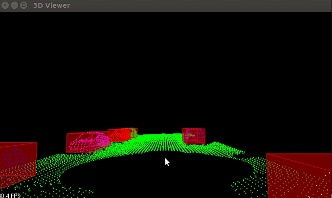

# Lidar 3D Obstacle Detection using Point Clouds
This is the first project in Udacity's Sensor Fusion Nanodegree.

## Project Specifications
This project is based on PCL library that is used to read and process point cloud data obtained using 3D Lidar sensor. Aim is to detect 3d obstacles (other vehicles) in the surrounding of the ego vehicle and create appropriate bounding boxes around them. This repository has code for both the custom (implemented by me) as well as PCL's built in segmentation and clustering methods. 

## Pipeline:
1. Seperate points associated with the road from points associated with the vehicles. For this 3D ransac is implemented. 
2. Using point cloud of obstacles, all the obstacles are seperated into different clusters. For this, an Euclidean clustering algorithm is implemented which uses KDTree for finding the nearest neighbours of the given point within a given radius.
3. Each cluster is given a different color and also a bounding box is created for each cluster.

## How to run
Clone the repo 
`git clone https://github.com/srane96/Lidar-Obstacle-Detection.git`  
Inside this directory, create a build directory and build the project 
`mkdir build && cd build`  
`cmake ..` 
`make` 
Then use the following command to run the code  
`./environment` 

## Output

## Code Structure
1. Continuous input of pcd data is processed inside the function named `cityBlockStream()` in `environment.cpp`
2. 3D Ransac is implemented in `processPointClouds.cpp` file, inside the function named `Segment()`.
3. Eucledean Clustering is implemented in file`processPointClouds.cpp`, inside the `CustomClustering()`.
4. Custom KDtree is implemented in the file named `src/kdtree.h` with struct named `PCKDTree`. 
